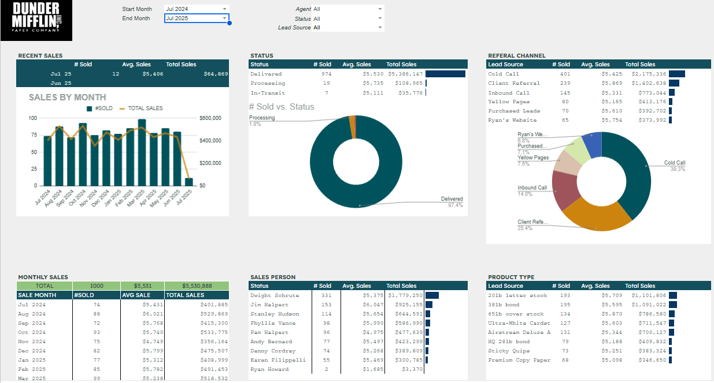
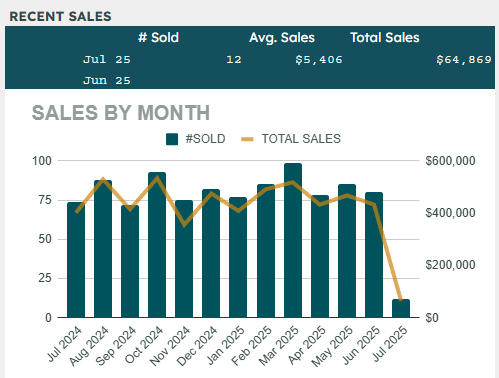
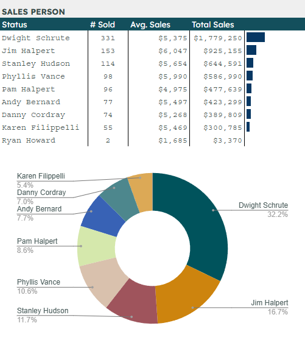

#  Sales Dashboard – Google Sheets

This project demonstrates **data visualization and anomaly detection** skills using Google Sheets.  
I used a Dunder-Mufflin Paper Company dataset (~1K+ records) with the following fields:  
`Product, Category, Region, Date, Revenue, Profit`.

---

##  Features
- **Pivot Tables** for multi-dimensional analysis:
  - Revenue & Profit by Region
  - Top Products by Sales
  - Category & Time-based trends
- **Interactive Slicers** to filter by Region, Category, and Time
- **Charts & Visuals**:
  - Line chart: Revenue trends over time
  - Bar chart: Top products by sales
  - Column chart: Profit by region
- **Anomaly Detection**:
  - Conditional formatting to flag **negative profits**
  - Highlight **seasonal spikes** and outliers

---

##  Dashboard Preview

### Full Dashboard


### Revenue Trends


### Sales by Sales Rep


---

## Insights  

The Sales Dashboard highlights actionable trends and anomalies across products, categories, and regions:  

- **Regional Performance**: Clear visibility into which regions drive the majority of revenue, alongside identification of underperforming regions with low or negative profit margins.  
- **Category Trends**: Product categories reveal seasonal spikes in demand. Some categories contribute strong revenue but show weak profitability, signaling potential profit leakage.  
- **Top Products**: Ranking of products by sales volume and revenue makes it easy to spot high-value contributors, while also flagging products that sell well but erode margins.  
- **Revenue & Profit Over Time**: Time-series charts display seasonal cycles and highlight periods of growth versus decline, supporting better forecasting and planning.  
- **Anomaly Detection**: Conditional formatting surfaces negative profit transactions and unusual performance outliers, ensuring quick attention to problem areas.  


---

##  Deliverables
- [ Live Dashboard (Google Sheets)](https://docs.google.com/spreadsheets/d/1SnlmyJ19LUXk3nko8yYqmxbrp_CMVKUhaTcp1hHv7qs/edit?usp=sharing)  
- [ Dataset (CSV)](./Dunder_Mifflin_Sales_Dashboard-DATA.csv)  
- [ README (this file)](./README.md)  

---
## Folder Structure  

```
/sales-dashboard/
  ├ data/              ← raw dataset (CSV or Sheets link)
  ├ images/            ← screenshots for README (optional)
  ├ dashboard/         ← Google Sheets link (if exported)
  └ README.md
``` 
## References  

- Google Sheets documentation: QUERY, FILTER, SUMIFS, Data Validation, Charts  
- Google Apps Script documentation 
---


